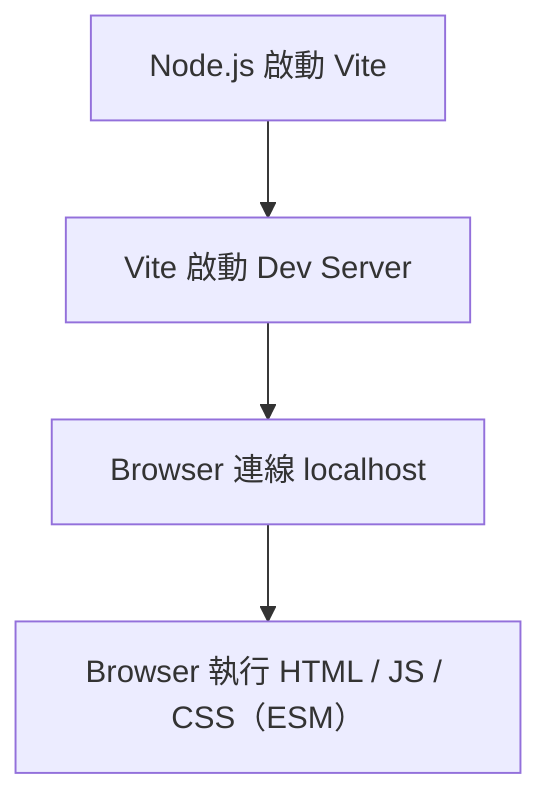

# Vite learn


## 🧱 腳手架(Scaffolding)是什麼？

👉 預先幫你搭好專案基本結構與設定的工具

你不用從 0 開始建資料夾、設定環境、寫初始程式，它會幫你：

建立專案目錄結構
安裝必要套件
設定開發環境
產生基本範例程式

---

Vite, Webpack 常常被拿來比較, 因為他們都屬於**前端建構工具(Tooling)**, 負責專案的啟動, 開發體驗與打保流程

- **Vite** 是前端的 **工具鏈(建構/打包工具)**
- **React, Vue ** 是前端的 **UI框架(負責畫面與邏輯)

---

## 1. Vite是什麼?

**Vite**可以理解為: **建立, 開發, 打包前端專案的工具**.
它的核心有兩個部分:

- **開發伺服器(Dev server)**
  提供極快的啟動速度與熱更新(Hot Module Replacement, HMR)
- **生產建置( build)**
  把程式打包成可以上線部屬的靜態檔案(HTML / CSS /　JS)

---

## 工具鏈與執行環境比較

與其他前端工具鏈一樣 **大部分的啟動與執行環境都在Node.js**上:

| 工具 | 類型 | 開發模式 | 優點 | 缺點 |
|------|------|----------|------|------|
| Vite | 現代建構工具 | ESM + Dev Server | 啟動極快、HMR快、主流選擇 | SSR需額外處理 |
| Webpack | 傳統建構工具 | Bundle-based | 生態最成熟、客製化強 | 慢、設定複雜 |
| Parcel | 零設定建構工具 | Bundle-based | 幾乎不用設定、上手快 | 彈性較低 |
| esbuild | 打包工具（底層） | ESM | 極快（Go寫） | 功能較基礎 |
| Rollup | 打包工具 | ESM bundle | 打包乾淨、適合 library | Dev 體驗不如 Vite |

## Vite的啟動流程



## 補充: ESM是什麼?

ES(ES Modules) 是JavaScript官方的模組系統標準
他定義了JavaScript檔案之間如何匯入/匯出(import/export)

```javascript
// export
export function add(a,b){
    return a + b
}

//import
import {add} from './math.js'
```

你可以把ESM理解成:
JavaScript語言內建的模組規範, 且能被**瀏覽器原生支援**
Vite 在開發階段不需要先打包（bundle）, 而是讓瀏覽器「按需載入模組」

## 建議第一個Vite專案

### 方法A: 互動式建立

```shell
npm create vite@latest
```
執行後, vite會引導你選:
```
專案名稱
使用哪個框架(React / Vue / vanilla...)
JavaScript還是TypeScript
```
建立完成後
```shell
cd 你的專案名稱
npm install
npm run dev
```
Vite腳手架專案預設會提供以下指令:
```
npm run dev: 啟動開發伺服器
npm run build: 建置正式版
npm run preview: 本機預覽建置結果
```

### 方法B: 直接指定模板

如想建立React + TypeScript專案
```Shell
npm create vite@latest my-app -- --template react-tscd my-app
npm install
npm run dev
```
想建立Vue專案
```
npm create vite@latest my-vue-app -- --template vue
```
目前官方列出的模板包含....

## 建好後的基本專案結構
Vite有一個特色: index.html在專安根目錄, 而且是開發入口的一部分, 不像就工具那樣藏在public裏.
官方特別說明, 這是刻意設定的, 因為開發期間Vite本質上是一個伺服器, 而index.html是應用路口

常見的結構像這樣(一般模板):
```plaintext
my-app/
├─ node_modules/            # npm 安裝的所有套件（自動產生，不需手動修改）
├─ public/                  # 靜態資源資料夾（不經過打包）
│  └─ vite.svg              # 範例圖片，可用 /vite.svg 直接存取
├─ src/                     # 主要開發目錄（所有核心程式碼）
│  ├─ assets/               # 會被打包處理的資源（圖片、字型等）
│  │  └─ logo.svg           # 範例資源（需用 import 引入）
│  ├─ components/           # 可重用 UI 元件
│  │  └─ Example.jsx        # 範例元件
│  ├─ App.jsx               # 主應用元件（Root Component）
│  ├─ main.jsx              # 應用入口（負責掛載 App 到 DOM）
│  └─ style.css             # 全域樣式
├─ index.html               # ⭐ 應用入口 HTML（由 Vite 直接處理）
├─ package.json             # 專案設定與依賴管理
├─ vite.config.js           # Vite 設定檔（plugin / proxy / alias）
└─ README.md                # 專案說明文件
```